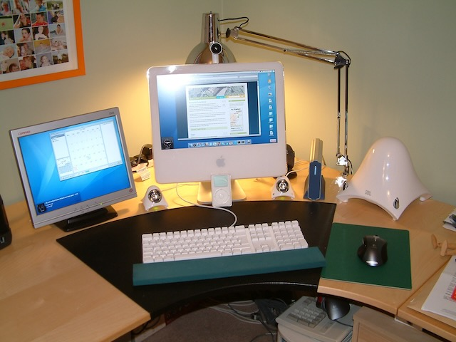

## Now

This is my [now page](https://nownownow.com/about). What I am doing right now(ish)

My name is Scott Paterson and I am an IT manager currently working for one of the UK's largest social care providers.

I have been working in IT for nearly 40 years and have done most things from data analyst, software developer, infrastructure support and design, networks and much more.

### My tech

I have been a fan of Apple products for the last 20 odd years starting with my first iMac (see below). My current setup is an M3 MacBook Air with 16GB/512GB which I absolutely love. The Air is really perfect and although a technical downgrade from my previous MacBook Pro, a 16" M1, it really does everything I need without breaking a sweat and is so small and light I just love it.

I have a bunch of other Apple kit including 6th gen iPad Mini, iPhone 15 and whole bunch of antique Apple kit (original Macintosh, eMate 300, Newtons, G4 iMac, Intel iMac... I could go on...)

Just bought a [DJI Mini 4K](https://www.dji.com/uk/mini-2-se) but not had time to make real use of it yet, one to work on.

### Interests

I am a keen cyclist (when I can) and use Zwift in my garage when I don't have time to get out in the lanes for a "proper" ride.

I am reviving my interest in HiFi and have a pair of [Kef LSX II](https://uk.kef.com/products/lsx-2) active speakers on my office desk (in front of me) which are just stunning. I have a [Pro-ject T1 BT](https://www.project-audio.com/en/product/t1/) turntable that hooks up to the Kefs for those days when I feel like spinning some of my old vinyls.

### Entertainment

Rewatching Breaking Bad for the first time for many years and loving it all over. Still makes me wince in places even tough I know whats coming (the ATM scene !)

### Family

Four grown up kids, recently grown in numbers to 5 grand kids.

---
## History

[UKMac.net](https://ukmac.net) has been around in many versions and using many web publishing systems since around 2005.

My interest in Macs goes back before the beginning of this site but really took off when I bought my first 17" G5 iMac.

