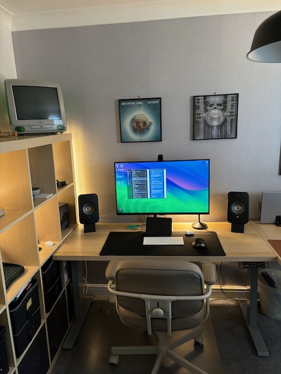

Finished sorting my office today and am really happy with how it looks now. I spend a lot of time in here so its important for me that I have a nice environment to work in. The addition of a few led light strips and a clear out of some of the clutter has improved the aesthetic considerably I think.

I have included a link to my standing desk frame below. I have procrastinated over getting a standing desk for months and now I have one I wish I hadn't. I find that I spend at least half my working day standing now and feel much better for it. If you are sitting on the fence (or your desk chair) debating if you should move to a standing desk I would definitely recommend doing it. If you can re-use your existing desktop as I did the cost is pretty reasonable (this one was aroound £170). Do it, your back will thank you later.

## Daily Links

|Link|Description|
|--------|----|
|[Sleeve](https://replay.software/sleeve)| Sleeve is a stylish now playing app that fills the gap left by Apple not providing a widget for the Apple Music app in macOS Sonoma. Sleeve is a paid app rather than a subscription and costs around £6 in UK. It can also share you played tracks to your Last.fm account. |
|[MAIDeSITe Height Adjustable Electric Standing Desk Frame](https://www.amazon.co.uk/dp/B08CN9JVZS?ref=ppx_yo2ov_dt_b_product_details&amp;th=1&_encoding=UTF8&tag=muxtoncom-21&linkCode=ur2&linkId=582a9e970bfc42ad12f97200de8aa650&camp=1634&creative=6738)| This standing desk frame is the one I recently bought to replace my static desk. Not expensive and highly recommended if you want a solid standing desk frame. |
|[USB COB Led Strip](https://www.amazon.co.uk/dp/B0B1JQYVMT?psc=1&amp;ref=ppx_yo2ov_dt_b_product_details&_encoding=UTF8&tag=muxtoncom-21&linkCode=ur2&linkId=2c1eac90e6f42f23b00c4661d328285c&camp=1634&creative=6738)| USB lighting strip providing lights behind cabinets in my office |